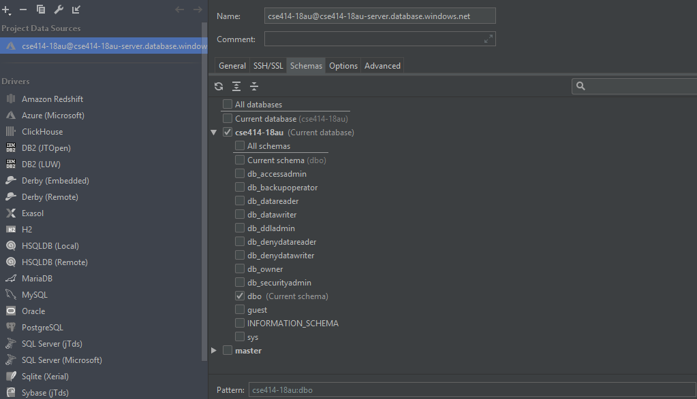
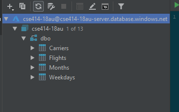

# CSE 414 Homework 3: Advanced SQL and Azure 

**Objectives:**
To practice advanced SQL. To get familiar with commercial database management systems (SQL Server) and using a database management system in the cloud (SQL Azure). 

**Assignment tools:**
SQL Server on Windows Azure through SQL Azure. SQL Server Management Studio
has been installed on the CSE lab and [VDI machines](http://vdi.cs.washington.edu/vdi/) if you would like to use that.

**Assigned date:** Monday, April 15, 2019

**Due date:** Friday, April 26, 2019. You have 1 week and 4 days for this assignment.

**What to turn in:**
`hw3-q1.sql`, `hw3-q2.sql`, etc. (see below).

## Assignment Details

This homework is a continuation of homework 2 but with three changes:

- The queries are more challenging
- You will get to use a commercial database system (i.e., no more SQLite :). 
SQLite simply cannot execute these queries in any reasonable amount of 
time; hence, we will use SQL Server, which has one of the most advanced 
query optimizers.
- You will use the Microsoft Azure cloud.

In this homework, you will do three things:

1. Create a database in the SQL Server database management system running as a service on 
Windows Azure; import data from an Azure public blob.
2. Write and test the SQL queries below; keep in mind that the queries are quite challenging, 
both for you and for the database engine. 
3. Reflect on using a database management system running in a public cloud.

### A. Setting up an Azure SQL Database [0 points]

In this assignment, we want you to learn how to use an Azure SQL database from scratch. 
Your first step will thus be to setup a database in the Azure service and importing your data. 
This step may seem tedious but it is crucially important. We want you to be able to continue using Azure after the class ends. For this, you need to know how to use the system starting from nothing.

**NOTE: These steps will take some time to complete, so start early!**

#### Step 1: Create an Azure account and log in to Azure portal

Click on the "Accept lab assignment" link in the email "Action required: Accept your lab assignment", log in using your uw.edu account and the password.

Afterwards, you will be forwarded to the [Azure portal](https://portal.azure.com/).


#### Step 2: Learn about Azure SQL Server

Spend some time clicking around, reading documentation, watching tutorials, and generally familiarizing yourself with Azure and SQL Server.


#### Step 3: Create a database

From the [Azure portal](https://portal.azure.com/), select "+ New" on the left, 
,
then select "Databases", then select "SQL Database". This will bring up a panel with 
configuration options for a new DB instance.

Perform the following configuration:
- Choose a database name (e.g., "cse414-19sp").

- create a new resource group with a name (e.g., "myresourcegroup").

- Select a source: Blank database

- Create a new server by clicking on "Server" (it will say "Configure required settings"). A second panel will appear to the right; click on "Create a new server" and a third panel will appear to the right of this. Fill in the form as follows:

- Choose a name for the server (e.g., "fooBarSqlserver"). Unlike your database name, the server name must be unique across the universe of Azure SQL databases.

- Choose an admin login and password. (You will need this when access your database using tools other than the portal.)

- Set the location to "West US" or "West US 2".

- Make sure "Allow azure services to access server" is checked.

- Make sure "Advanced Threat Protection" is set to "Not now". 

- SELECT.

- Make sure the pricing tier is "Standard S0" (This is the current default setting). If you need to change it, find the slider for "DTUs", and turn it all the way down to 10. It should now say the monthly cost is only $15/month.

- CREATE.

- Select "Pin to dashboard".

You will see a panel on the dashboard that says "Deploying SQL Database" while the database is being set up: this will take a while. Once that is done, it should open up a panel with details on your database. (If not, click on the panel for your SQL database to open it.)

Finally, scroll down to the "Security" section on the left side bar, click "Firewalls and Virtual networks".
You may need to change the settings before you can upload data. 
The easiest option is to add a rule that allows connections from any client, 
which you can do as follows:


Be sure to click "Save" once you have added this rule.


#### Step 4: Try out the database

The simplest way to play with the database is using the built-in Query editor in the Azure portal.
To launch this, go back to the dashboard, then click on the SQL database that you just setted. Enter the editor by clicking the "Query editior(priview)" on the side bar.

Enter the username and password that you chose when you created your database in Step 3. Once you have done that, you can try entering SQL commands. Press the "Run" button to execute them.

Now you are ready to move on to the next part of the assignment!


### B. Ingesting Data (0 points)

Next, you will import all the data from HW2. Make sure that you execute your 
`CREATE TABLE` statements first so that the tables you will add tuples to already exist. 
Also, make sure that the types of the columns in the tables you created match the data.

The data used in this assignment is the same as that in hw2, in the `flights-small.csv`, `carriers.csv`, `months.csv`, and `weekdays.csv` files.
If you wish, you may import this data directly into your Azure SQL Server database.
Two tools that make this possible are `bcp` (or `freebcp` on Unix/Mac, as part of [freetds](http://www.freetds.org/userguide/)) and the SQL Server Management Studio.
However, we do not recommend you use these tools because it is easy for character or line-ending encoding issues across platforms to corrupt your data.

The easy, recommended way to ingest the data is by importing the data from a public blob storage container that we created for you.
A "public blob" is that Microsoft calls its shareable storage hosted in the Azure cloud.
Often it is easier to import data from within the same cloud (Azure), as opposed to data from outside the cloud (e.g., your local computer).

Please run the following query, which creates tables in your database and runs a bulk import to fill the tables from the csv files in the public blob:

```sql
CREATE EXTERNAL DATA SOURCE cse414blob
WITH (  TYPE = BLOB_STORAGE,
        LOCATION = 'https://cse4142019sp.blob.core.windows.net/cse4142019sp'
);

bulk insert Carriers from 'carriers.csv'
with (ROWTERMINATOR = '0x0a',
DATA_SOURCE = 'cse414blob', FORMAT='CSV', CODEPAGE = 65001, --UTF-8 encoding
FIRSTROW=1,TABLOCK);

bulk insert Months from 'months.csv'
with (ROWTERMINATOR = '0x0a',
DATA_SOURCE = 'cse414blob', FORMAT='CSV', CODEPAGE = 65001, --UTF-8 encoding
FIRSTROW=1,TABLOCK);

bulk insert Weekdays from 'weekdays.csv'
with (ROWTERMINATOR = '0x0a',
DATA_SOURCE = 'cse414blob', FORMAT='CSV', CODEPAGE = 65001, --UTF-8 encoding
FIRSTROW=1,TABLOCK);
```

**NOTE**: The following import will often take more than 5 minutes. This means
you will need to download DataGrip and perform the query from there as the Azure
SQL query editor has a maximum timeout of 5 minutes.

```sql
-- Import for the large Flights table
-- This last import might take a little under 5 minutes on the provided server settings
bulk insert Flights from 'flights-small.csv'
with (ROWTERMINATOR = '0x0a',
DATA_SOURCE = 'cse414blob', FORMAT='CSV', CODEPAGE = 65001, --UTF-8 encoding
FIRSTROW=1,TABLOCK);
```

Do some `SELECT count(*)` statements to check if your imports were successful.

- Carriers has 1594 rows
- Months has 12 rows
- Weekdays has 8 rows
- Flights has 1148675 rows

### B. Ingesting Data (Alternative) (0 Points)

There's another way to upload the data with an IDE called DataGrip. It's a useful program, and also functions as a good place to write and execute your SQL queries with the Azure database. You can use it for the trial period which should be plenty (and once your data is uploaded to Azure you can use the web interface afterwards if you don't want to stick with DataGrip.)

Here's the main page and some steps to get you to the upload:
[https://www.jetbrains.com/datagrip/](https://www.jetbrains.com/datagrip/)

1. Instructions for connecting to Azure:
   [https://www.jetbrains.com/help/datagrip/connecting-to-a-database.html#ms_azure](https://www.jetbrains.com/help/datagrip/connecting-to-a-database.html#ms_azure)

2. At this point you should run your create table statements in Azure.

3. There's an extra step here they don't mention in the connection instructions, to make your tables visible. When setting up your data source, you have to click      the schemas tab and check the boxes for the database name, and dbo.

``` NOTE: The picture corresponds to cse414-18au, but for us it should say cse414-19sp instead```



4. Now your tables should be visible in the drop down box.



5. Now you can import the csvs by right clicking the table to want to upload and finding the .csv file.
   [https://www.jetbrains.com/datagrip/features/importexport.html](https://www.jetbrains.com/datagrip/features/importexport.html)


### C. SQL Queries (90 points):

For each question below, write a single SQL query to answer that question 
(you can use subqueries this time), and save your submission in individual files `hw3-q1.sql`, `hw3-q2.sql`, etc.
For each query, add a comment to each query 
the number of rows your query returns, how long the query took, and the first 20 rows of 
the result (if the result has fewer than 20 rows, output all of them). 
You can find the query time on the right side of the yellow bar at the bottom of 
the window. You can simply copy and paste the first rows into the comment. 

Note that SQL Server interprets NULL values differently than sqlite! Try using it in a 
`WHERE` predicate and you will see the difference.

Now answer the following questions:

1. For each origin city, find the destination city (or cities) with the longest direct flight.
By direct flight, we mean a flight with no intermediate stops. Judge the longest flight in 
time, not distance. (15 points)

    Name the output columns `origin_city`, `dest_city`, 
    and `time` representing the the flight time between them. 
    Do not include duplicates of the same origin/destination city pair. 
Order the result by `origin_city` and then `dest_city` (ascending, i.e. alphabetically).
    
    [Output relation cardinality: 334 rows]

2. Find all origin cities that only serve flights shorter than 3 hours. 
You can assume that flights with `NULL` actual_time are not 3 hours or more. (15 points)

    Name the output column `city` and sort them. List each city only once in the result.

    [Output relation cardinality: 109]

3. For each origin city, find the percentage of departing flights shorter than 3 hours. 
For this question, treat flights with `NULL` `actual_time` values as longer than 3 hours. (15 points)

    Name the output columns `origin_city` and `percentage`
Order by percentage value, ascending. Be careful to handle cities without any flights shorter than 3 hours. 
We will accept either `0` or `NULL` as the result for those cities.
Report percentages as percentages not decimals (e.g., report 75.25 rather than 0.7525).

    [Output relation cardinality: 327]


4. List all cities that cannot be reached from Seattle though a direct flight but can be reached with 
one stop (i.e., with any two flights that go through an intermediate city). 
Do not include Seattle as one of these destinations (even though you could get back with two flights). 
(15 points)

    Name the output column `city`. Order the output ascending by city.
    
    [Output relation cardinality: 256]


5. List all cities that cannot be reached from Seattle through a direct flight nor with one stop 
(i.e., with any two flights that go through an intermediate city). Warning: this query might take a while to execute.
We will learn about how to speed this up in lecture. (15 points)

    Name the output column `city`. Order the output ascending by city.
    
    (You can assume all cities to be the collection of all `origin_city` or all `dest_city`)

    (Note: Do not worry if this query takes a while to execute. We are mostly concerned with the results)
    
    [Output relation cardinality: 3 or 4, depending on what you consider to be the set of all cities]


6. List the names of carriers that operate flights from Seattle to San Francisco, CA. 
Return each carrier's name only once. Use a nested query to answer this question. (7 points)

    Name the output column `carrier`. Order the output ascending by carrier.
    
    [Output relation cardinality: 4]

7. Express the same query as above, but do so without using a nested query. Again, name the output column
`carrier` and order ascending. (8 points)


### D. Using a Cloud Service (10 points)

The DBMS that we use in this assignment is running somewhere in one of Microsoft's data centers. 
Comment on your experience using this DBMS cloud service. What do you think about the idea of offering a DBMS 
as a service in a public cloud?

Save your answer in a file called `hw3-d.txt` in the `submission` directory.


## Submission Instructions
Answer each of the queries above and put your SQL query in a separate file. 
Call them `hw3-q1.sql`, `hw3-q2.sql`, etc (and `hw3-e.txt` for the last question). 
Make sure you name the files exactly as is. Put your files inside `hw3/submission`.

**Important**: To remind you, in order for your answers to be added to the git repo, 
you need to explicitly add each file:

```sh
$ git add hw3-q1.sql hw3-q2.sql ...
```

**Again, just because your code has been committed on your local machine does not mean that it has been 
submitted -- it needs to be on GitLab!**

Use the same bash script `turnInHw.sh` in the root level directory of your repository that 
commits your changes, deletes any prior tag for the current lab, tags the current commit,
and pushes the branch and tag to GitLab. 

If you are using Linux or Mac OSX, you should be able to run the following:

```sh
$ ./turnInHw.sh hw3
```

Like previous assignments, make sure you check the results afterwards to make sure that your files
have been committed.
