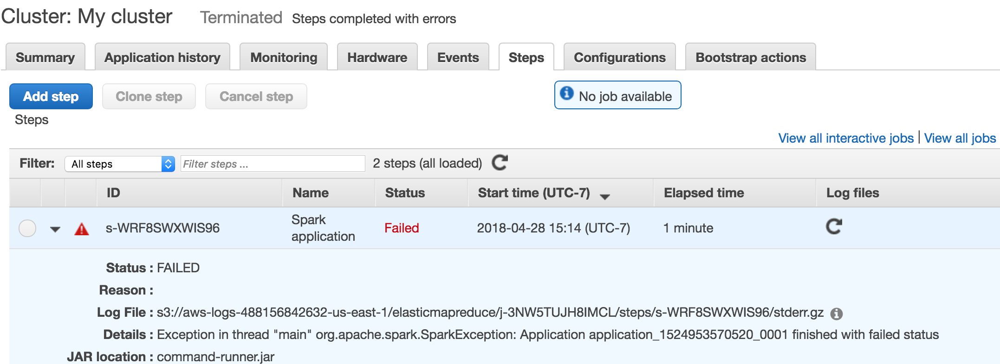
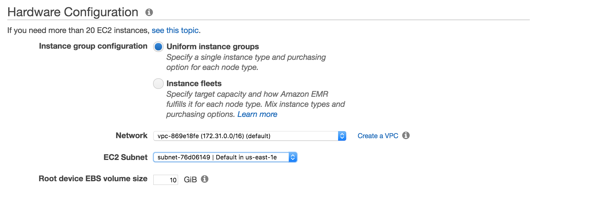

# CSE 414 Homework 6: Parallel Data Processing and Spark

**Objectives:**  To practice writing queries that are executed in a distributed manner. To learn about Spark and running distributed data processing in the cloud using AWS.

**Assigned date:** Friday, May 10, 2019.

**Due date:** Friday, May 24, 2019.

**What to turn in:**

A single Java file for entire assignment, `HW6.java` in the `submission` directory, along with the text outputs from AWS. A skeleton `HW6.java` has been provided for you in the starter-file. **Make sure you copy this over to `submission` before working on the assignment to avoid repo conflicts.** You should not change any of the method's signatures. You should not need to create any other class to complete this assignment, although you are free to do so.

**Resources:**

- [Spark programming guide](https://spark.apache.org/docs/2.4.0/rdd-programming-guide.html)
- [Spark Javadoc](https://spark.apache.org/docs/2.4.0/api/java/index.html)
- [Amazon web services EMR (Elastic MapReduce) documentation](https://aws.amazon.com/documentation/emr/)
- [Amazon S3 documentation](https://aws.amazon.com/documentation/s3/)
- [Small dataset for local testing](https://courses.cs.washington.edu/courses/cse344/17au/assets/flights_small.tar.gz) 
- Alvin Cheung's research group has been working on a tool called [Casper](https://courses.cs.washington.edu/courses/cse344/tools/casper/) that translates sequential Java to Hadoop/Spark. Feel free to use it to learn Spark syntax. This is entirely optional.

## Assignment Details

In this homework, you will be writing Spark and Spark SQL code, to be executed both locally on your machine and also using Amazon Web Services.

We will be using a similar flights dataset from HW2 and HW3. This time, however, we will be using the *entire* data dump from the [US Bereau of Transportation Statistics](https://www.transtats.bts.gov/DL_SelectFields.asp?Table_ID=236&DB_Short_Name=On-Time), which consists of information about all domestic US flights from 1987 to 2011 or so.  

The data is stored in a columnar format called [Parquet](https://parquet.apache.org/) and is available publicly on Amazon [S3](https://aws.amazon.com/s3/). S3 is Amazon's cloud storage service. The data is around 4GB compressed (79GB uncompressed), and contains 162,212,419 rows. Hence you probably don't want to be crunching on this dataset using your laptop! Each row contains 109 different attributes (see `HW6.java` for details), although you will only need to use a few of them in this homework. Note that the attribute names are different from those in HW2/HW3, and are described at the end of your HW java file you will work in as a giant block comment.

To help you debug, we provide a subset of the data on [the course website](https://courses.cs.washington.edu/courses/cse344/17au/assets/flights_small.tar.gz). This dataset is a dump of all the flights that happened on November 4, 2010. Remember that this is in [Parquet](https://parquet.apache.org/) format, not CSV as in HW2 and HW3. **We STRONGLY encourage you to run your code using this small dataset locally before trying it out on AWS.** See instructions below.

Here is a rough outline on how to do the HW:

- Sign up for AWS
- Accept AWS Educate Invitation
- Complete the HW locally
- Run your solutions on AWS Elastic MapReduce one at a time when you are fairly confident with your solutions

### A. Sign up on Amazon Web Services

Follow these steps to set up your Amazon Web Services account.

1. You should have received an e-mail from AWS with the subject "You have been invited to join an AWS Educate Classroom" (**NOTE:** If you have not received this e-mail, notify the course staff immediately). Open the e-mail and click on the sign-in link to "AWS Educate" near the end of the message. If you do not have an Amazon Web Services account yet you will need to make one. Make sure that you use the same e-mail address that the e-mail was sent to, otherwise you will be unable to utilize the credits that we have given you. You will also likely need to apply for an AWS Educate account, if it asks for a promo code you can leave that section blank as it is not necessary. **Make sure to do this ASAP as the application can take some time**.

2. After creating an account you should end up on the AWS Educate landing page that looks like so:

    

    If not, go back to the e-mail and click on the link again or go to [this link](https://www.awseducate.com/student/s/).

3. Click on "My Classrooms" on the top of the page and you should be taken to a page that looks like this:

    

    Accept the invitation and then the invitation should change to a button with the message "Go to classroom" and an arrow:

    

    This should take you to a page that looks like this:

    

    This site is no longer part of Amazon but a third-party provider that they use as the entry portal. If you click on "AWS Console" on the right side of the page it will take you back to Amazon Web Services in the precise location where you will utilize S3 and EMR. The instructions on using these tools will come later in this homework specification.

    **IMPORTANT: Keep track of the amount of your credits that you are using by going back to the Vocareum portal... If you get close to $0 in credits let us know and we can provide you with more. However you should not need more than $50 of credits for this homework. If you had to enter credit card information when signing up for AWS they will likely charge your account if you go over the credit threshold so you should make sure to monitor the amount of credits that you have in your account.**

    You should get $50 from AWS via the Educate Classroom. The credits that you have left over after the assignment are for you to keep, but *if you exceeded the credits due to forgetting to turn off your clusters, mining bitcoins, etc. then you will be responsible for paying the extra bill.*

Now you are ready to run applications using Amazon cloud. But before you do that let's write some code and run it locally.

### B. Download Spark

Go to `https://spark.apache.org/downloads.html`. Choose Spark release 2.4.3, package type "Pre-built for Apache Hadoop 2.7 and later". Download the tgz file.

Unzip the tgz file somewhere in your computer. The rest of the document assumes you place the spark directory in `/usr/local`; update the links if not.

Here are [some hints](https://guendouz.wordpress.com/2017/07/18/how-to-install-apache-spark-on-windows-10) in case you like to install Spark on your own Windows machine.

### C. Run Code Locally

Use your favorite text editor/IDE and open `HW6.java` to check out the code. You have provided an example method, `warmup`, that you can run after compiling the code. To do this, add all the jar files that come with Spark to classpath as follows:

Compile:

```sh
javac -cp "/usr/local/spark-2.4.0-bin-hadoop2.7/jars/*" HW6.java
```

Run:

```sh
java -cp "/usr/local/spark-2.4.0-bin-hadoop2.7/jars/*:." HW6 <path to the flights data directory> <path to output directory where you want the output to be stored>
```

Some notes on modifying the above commands:

- Make sure that you use the fully-qualified directory path (starting from root, "/" on Mac, "C:/" on Windows) if you use some other path. The paths above are for a Linux system where they had spark-2.4.0, your path will likely be different
- Use ";" instead of ":" as the classpath separator on Windows

If you are using an IDE:

- For Eclipse, you can do the same thing by right clicking on the project name → "Build Path" → "Configure Build Path" → Libraries → "Add External JARs". To run you program with arguments, go to "Run" → "Run Configurations".
- For IntelliJ, go to File → Project Structure → Libraries → "+" to add the folder containing your Spark JARs.

You will likely get some warning messages such as `WARN NativeCodeLoader: Unable to load native-hadoop library for your platform... using builtin-java classes where applicable`. You can safely ignore those.
  
The output will be stored in a file (called `part-XXXXX`) in the output directory you specified (the directory structure may depend on your platform). That is just a plain text file that you can open that file with any text editor. **You will get an error if the output directory already exists, so delete it before running your program.** Be sure you read through the code and understand what is going on.

### D. Run Code on Elastic Map Reduce (EMR)

We will use Amazon's [Elastic Map Reduce](https://aws.amazon.com/emr/) (EMR) to deploy our code on AWS. Follow these steps to do so after you have set up your account, received credits as mentioned above, and have tested your solution locally. *Read this carefully!*

1. Toggle the `SparkSession` initialization on line 32-36 of `HW6.java` to allow it to run on AWS. Then create a jar file containing your class files. On the home VM you can do this with:

    ```sh
    jar cf HW6.jar *.class
    ```

    This creates `HW6.jar` that includes all `.class` files inside your current directory.

2. Go to the "AWS Console" from the Vocareum landing page as we saw in the instructions above, the page should look like this:

    

3. Browse through the listed options or search for "S3" in the search box to open up the S3 console which should look like this:

    

4. Create a bucket by clicking "+ Create Bucket" in the top left and name it whatever you want. For the rest of these instructions we will assume you are using a bucket named "cse414-bucket" but you can name it whatever you like. When creating the bucket, keep all of the default settings.

5. Click into the newly created bucket and select "Upload" and upload your HW6.jar file. **REMEMBER: You need to recompile your Java program with the correct line uncommented as we stated in step 1**

6. Go back to the "AWS Console" from step 3 and now search or browse for "EMR". Clicking on it will take you to a page that looks similar to the image below:

    

    **NOTE:** Above the EMR console already has some created clusters, yours will not on the first time you end up on this page.

7. Make sure that you are in `US East (N. Virginia)` or `US East (Ohio)` in the top right of the page. This is because the full, public data file that we will use is stored there, so it will be faster to access from a machine located elsewhere in the world.

8. Select **Create Cluster** to begin the process of creating a new cluster it will take you to a page that looks like this:

    

    You need to select "Go to advanced options" at the top so we can more accurately specify our configuration.

9. On this first page you need to select the most recent release of EMR (emr-5.23.0) as well as `Hadoop 2.8.5` and `Spark 2.4.0`. You can uncheck the rest of the boxes. It should then look like the following image:

    

10. This is the big one! Next, scroll to the **Add Steps** section near the bottom of the page and select **Spark application** from the "Step Type" dropdown and then click **Configure**. A "step" is a single Spark job to be executed. You can specify multiple Spark jobs to be executed one after another in a cluster. Add a Spark application step by filling in the textboxes so that your screen looks like this:

    

    Again for copy and paste:

    ```txt
    --class HW6

    s3://us-east-1.elasticmapreduce.samples/flightdata/input
    ```

    The `--class` option under "Spark-submit options" tells Spark where your `main` method lives (in this case inside `HW6.class`).

    The "Application location" should just point to where your uploaded jar file is. You can use the folder button to navigate.

    Make sure you fill out the correct bucket names. There are two arguments listed (and separated by a space, as if you were running the program locally):

    - The first one specifies where the input data file directory is.
    - The second one specifies where you want the output to be written. EMR can only write to a bucket, but you can download the output from the bucket afterwards. Use the same bucket where you uploaded the HW6 jar file, but specify a new folder like `s3://cse414-bucket/output`. Remember to change the bucket name `cse414-bucket` to whatever you named your bucket in the previous steps.

    **IMPORTANT: In your s3 bucket, you should not manually create an output folder, if you create it before you run your application there will be errors as the application creates the output folder itself. Before each subsequent run you must delete the output folder inside of the bucket in order to avoid getting errors**

    Change **Action on failure** to **Terminate cluster** (or else you will need to terminate the cluster manually). Then click **Add**.

    The last step before we move on is to check the box that says **Auto-terminate cluster after the last step is completed.** This will ensure that your cluster shuts down and doesn't expend more credits then necessary after it is finished.

    Finally click **Next** at the bottom of the page to take you to the next step of cluster configuration.

11. On this page we want to launch a three node m4.large EMR cluster with Spark to execute the code. m4.large is an "instance type" on AWS, which is analogous to some set of allocated resources on a server. You can edit the instance type by clicking on the edit icon under the "instance type" column as seen below:

    

    The image above currently has the "Master" node set to an m3.xlarge. We suggest that you change all of your nodes to type m4.large to be the most efficient with your credits.

    Click **Next** to proceed to the next step.

12. On the final page you need to uncheck the box that says "Termination Protection" as seen in the image below:

    

    Click **Next** to proceed to the final step.

13. In this step you can leave all the default settings, however, you can optionally create an [EC2 pair](http://docs.aws.amazon.com/AWSEC2/latest/UserGuide/ec2-key-pairs.html) if you want to ssh into the machines you are about to create.

14. Click **Create cluster** once you are done and your cluster will start spinning up!

It will take a bit for AWS to both start the machines and run your Spark job. As a reference, it took 10 mins to run the `warmup` job on EMR using 1 master and 2 core nodes. You can monitor the status of your cluster on the EMR homepage.

Use the "Clone" cluster button to copy the settings into a new job when you run your actual HW problems. **Each time you want to run a new EMR job, make sure to recompile your solution and pack it into a jar for uploading into S3 as well as delete the output folder from the previous run**

**Make sure you terminate the cluster!** It should do so if you selected the options above. You should check this each time you look at the HW, just to make sure you don't get charged for leaving a cluster running.

You can now check the output by clicking on the bucket you have created on S3. Text written to standard output, if any (e.g., from `System.out.println`), are located in the `containers/application<ID>/container<ID>/stdout.gz`, if you have enabled logging when you launched the EMR cluster.

It's fine if you see warning (or even occasional error) messages in the logs. If your EMR job finishes successfully, you should see something similar to the below in the main EMR console screen:


#### Debugging AWS jobs

Debugging AWS jobs is not easy for beginners. Besides making sure your program works locally before running on AWS, here are some general tips:

- Make sure that you set the job details (i.e., options, arguments, bucket names, etc) correctly!
- Make sure you switched the two lines of code mentioned to run your job on AWS instead of locally.
- Make sure you replace your jar to test a new solution!
- **99% of cluster failures or errors are due to the first three points!**
- The easiest way to debug is to look at the output/logging files. Spark generates a lot of log files, the most useful ones are probably the `stderr.gz` files listed under `containers/application.../container/stderr.gz`. You will have one `container` folder per machine instance. So make sure you check all folders. You should also check out the log files that you have specified when you created the job in Step 8 above. You can also see the names of those files listed as "Log File" under "Steps":

    
- It is rare that your HW solution is fine but the cluster fails. This is usually due to AWS not being able to grab your machines due to the demand for the instance type saturating the supply available. If you can't find available instances in a region, try changing to a different *EC2 subnet*, like so:

    
- Spark have a web UI that you can set up to check on job progress etc. You can check out [their webpage](http://docs.aws.amazon.com/emr/latest/ManagementGuide/emr-web-interfaces.html) for details. But these are more involved so you are probably better off to first try examining the logs.  Specifically, try the "Application History" tab and the dropdown.

#### IMPORTANT: Cleanup after completing the HW

Double check that the clusters you have created are all terminated.

S3 charges by [downloading/uploading data from/to the buckets](https://aws.amazon.com/s3/pricing/). So once you are done with the assignment you might want to delete all the buckets that you have created (in addition to shutting down any EMR clusters that you have created).

The amount you are allocated from Amazon should be more than enough to complete the assignment. And every year we have students forgetting to shut down their cluster/clean up their buckets and that can result in substantial charges that they need to pay out of pocket. So be warned!

### E. Problems

We have created empty method bodies for each of the questions below (`Q1`, `Q2`, etc). **Do NOT change any of the method signatures.** You are free to define extra methods and classes if you need to. Run all of the following problems on the full dataset.

Except for problem 1, you should use methods like `filter` and `mapToPair` from the [JavaRDD API](https://spark.apache.org/docs/2.4.0/api/java/index.html?org/apache/spark/api/java/JavaRDD.html). We recommend looking at `reduceByKey` and `toRDD` from [JavaPairRDD](https://spark.apache.org/docs/2.4.0/api/java/index.html?org/apache/spark/api/java/JavaPairRDD.html), and `toJavaRDD` from [JavaRDD](https://spark.apache.org/docs/2.4.0/api/java/org/apache/spark/rdd/RDD.html) classes to implement your solution. **Save the output from EMR to `q1.txt`, `q2.txt` etc and make sure you add those to your `submission` directory on gitlab**.

Going forward, remember that objects like `JavaRDD` are immutable like Java Strings. This means that doing something like `d.filter(...)` does not change `d` but rather returns the result of doing `filter(...)` on `d`.

1. Select all flights that leave from Seattle, WA, and return the destination city names. Only return each destination city name once. Implement this using the `Dataset` API. This should be trivial and is intended for you to learn about the `Dataset` API. You can either use the functional form (i.e., `join(...)`, `select(...)`) or write a SQL query using `SparkSession.sql`. Check the corresponding Spark Javadoc for the parameters and return values. Save the EMR output as `q1.txt` and add it to your repo. (10 points) [Result Size: 79 rows (50 rows on the small dataset), 10 mins on EMR]

    Hint: If you decide to write a SQL query, note that you should use single quotes inside your query for string literals (e.g., `'Seattle'`). Also, it does not matter what you name the output column as, since that information is not dumped to the output.

2. Implement the same query as above, but use the `RDD` API. We convert a `Dataset` to a `JavaRDD` by calling `javaRDD()` in the skeleton code. Save the EMR output as `q2.txt` and add it to your repo. (20 points) [Result Size: 79 rows (50 rows on the small dataset), 15 mins on EMR]

3. Find the number of non-cancelled flights per month that departs from each city, return the results in a RDD where the key is a pair (i.e., a `Tuple2` object), consisting of a `String` for the departing city name, and an `Integer` for the month. The value should be the number of non-cancelled flights. Save the EMR output as `q3.txt` and add it to your repo. (20 points) [Result Size: 4383 rows (281 rows on the small dataset), 17 mins on EMR] 

4. Find the name of the city that is connected to the most number of other cities with direct flights. Return the result as a pair that consists of a `String` for the city name, and an `Integer` for the *total number of flights* (not cities) to the other cities. Save the EMR output as `q4.txt` and add it to your repo. (25 points) [Result Size: 1 row, 19 mins on EMR]

    Hint: [check out this post](https://stackoverflow.com/questions/35389219/task-not-serializable-exception-in-spark-while-calling-javapairrdd-max) if you get a "Task Not Serializable exception in Spark" exception.

5. Compute the average delay from all departing flights for each city. Flights with NULL delay values (due to cancellation or otherwise) should not be counted. Return the results in a RDD where the key is a `String` for the city name, and the value is a `Double` for the average delay in minutes. Save the EMR output as `q5.txt` and add it to your repo. (25 points) [Result Size: 383 rows (281 rows on the small dataset), 17 mins on EMR]

## Submission Instructions

Turn in your `q1.txt`, `q2.txt`, ..., `HW6.java` and any other Java files that you created.

**Important**: To remind you, in order for your answers to be added to the git repo, you need to explicitly add each file:

```sh
git add HW6.java ...
```

**Again, just because your code has been committed on your local machine does not mean that it has been submitted -- it needs to be on GitLab!**

Use the same bash script `turnIn_Hw6.sh` in the root level directory of your repository that commits your changes, deletes any prior tag for the current lab, tags the current commit, and pushes the branch and tag to GitLab.

If you are using Linux or Mac OSX, you should be able to run the following:

```sh
./turnIn_Hw6.sh
```

Like previous assignments, make sure you check the results afterwards to make sure that your file(s) have been committed.
