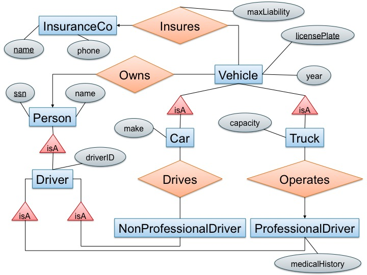

# CSE 344 Homework 7: Entity Relationship Diagrams and Conceptual Design

**Objectives:**
To be able to translate from entity relationship diagrams to a relational database, and to understand functional dependencies and normal forms.

**Assignment tools:**
- Part 1: Pen and paper or any drawing tools you prefer (e.g., powerpoint, [draw.io](https://www.draw.io)).
- Part 2: The setup you used in homework 3 (SQL Azure and the flights database).

**Assigned date:** TODO: Enter start date here

**Due date:** May 31, 2019. You have approximately 1 week for this assignment.

**What to turn in:**
- `hw7-part1.pdf`: A pdf containing some diagrams, some short decompositions, some free response questions
- Your completed version of `QuerySearchOnly.java`
- Test case(s) for the search command

**Resources:**

For part 1: Textbook chapter 3.1-3.4, 4.1-4.6

## Assignment Details

### Part 1: Theory

1. (10 points) Design an E/R diagram for geography that contains the following kinds of objects or entities together with the listed attributes. 

    Model the relationships between the objects with edges. Note that edges between entities can be labeled with constraints. Make sure to label only the/those primary key(s) that is/are mentioned below.

    **Entities**
    - countries (with attributes): name, area, population, gdp ("gross domestic product")
      - a country's name uniquely identifies the country within all countries
    - cities: name, population, longitude, latitude
      - a city is uniquely identified by its (longitude, latitude) (not by name, ex:there are 41 different cities and towns named Springfield in the US!)
    - rivers: name, length
    - seas: name, max depth
      - rivers and seas are uniquely identified within all water entities by their name (e.g., "Ganges" would be a unique water entity)

    **Relationships:**
    - each city belongs to exactly one country
    - each river crosses one or several countries
    - each country can be crossed by zero or several rivers
    - each river ends in either a river or a sea

    You can draw your diagrams on paper and scan them, take *quality* pictures of your drawn diagram, or use your favorite drawing tool such as Powerpoint, Keynote, or [draw.io](https://www.draw.io/). (FYI: Google Slides lacks a few shapes that you might need such as rounded arrows... You can use a cresent and a line)


2. (20 points) Consider the following E/R diagram: 

    
    
    *License plate* can have both letters and numbers;  *driverID* and *Social Security* contain only numbers;  *maxLiability* is a real number;  *year*, *phone*, *capacity* are integers; everything else are strings.
    - (10 points) Translate the diagram above by writing the SQL `CREATE TABLE` statements to represent this E/R diagram. Include all key constraints; you should specify both primary and foreign keys. Make sure that your statements are syntactically correct (you might want to check them using sqlite / Azure for instance).
    - (5 points) Which relation in your relational schema represents the relationship "insures" in the E/R diagram and why is that your representation?
    - (5 points) Compare the representation of the relationships "drives" and "operates" in your schema, and explain why they are different.


3. (20 points) Consider the following two relational schemas and sets of functional dependencies:
    - R(A,B,C,D,E) with functional dependencies D → B, CE → A.
    - S(A,B,C,D,E) with functional dependencies A → E, BC → A, DE → B.
    
    For each of the above schemas, decompose it into BCNF. Show all of your work and explain, at each step, which dependency violations you are correcting. Make sure you describe each step in your decomposition steps. (10 points each)


4. (15 points) A set of attributes X is called closed (with respect to a given set of functional dependencies) if X+=X. Consider a relation with schema R(A,B,C,D) and an unknown set of functional dependencies. For each closed attribute set below, give a set of functional dependencies that is consistent with it.
    - All sets of attributes are closed.
    - The only closed sets are {} and {A,B,C,D}.
    - The only closed sets are {}, {A,B}, and {A,B,C,D}.


### Part 2: Application

Flight booking service intro (35 points) 

**Description**

Congratulations, you are opening your own flight booking service!

You have access to a flights database. You will provide a service that lets users search through the database and book flights. (sounds familiar after HW3?)

In this homework, you will implement the first part of the flight booking service: searching for flights.
You will implement the booking and user management (logging in, paying for flights, managing reservations) components in the next homework.

The interface to this service will be command-line.  In the real world, you might design a web-based interface, but for this class we only ask for the simpler command-line version.  We provide code for the overall interface (including the code that establishes a JDBC connection to your SQL Server database in Microsoft Azure); you need to implement the functionality!

For this homework you can use any of the classes from the [Java 8 standard JDK](https://docs.oracle.com/javase/8/docs/api/) as that is the supported platform on the home VM. If you like to use any external libraries beyond the JDK and those provided inside the `lib` folder, please check with the staff first.

Please do not create additional tables for this homework; only the Flights table from hw3 is relevant.

This part consists of two tasks: implementing the search command in `QuerySearchOnly.java` (ensuring that it is not vulnerable to SQL Injection) and writing test case(s)for the search command.

#### Task 0: Running the starter code (0 points)

Your system will be a Java application. Clone the starter code files from the course repo and **copy everything (including `lib`) to the submissions folder before making changes!** You will see the following files:

- `FlightService.java`: the command-line interface to your flight-booking service.
Calls into `Query.java` to run customer transactions. Do not change this file.

- `QuerySearchOnly.java`: code to run flight searches against your database. You will need to change this file.

- `Query.java`: the full version of the flight booking service. Used in the next homework. You do not need to edit or submit this file for this homework.

- `dbconn.properties`: a file containing settings to connect to your database. You need to edit it before running the code that you are given, but you don't need to turn it in.

- `lib`: containing the following `.jar` (which are just archives of compiled Java classes/programs) files that allow your code to execute

  - `sqljdbc4.jar`: the JDBC to SQL Server driver. This tells Java how to connect to a SQL Azure database server, and needs to be in your `CLASSPATH` (see below).

  - `hamcrest-core-1.3.jar`, `junit-4.12.jar`: these are libraries for running the test cases.

- `runTest.sh`: a simple bash script that compiles your code and runs test cases using the [JUnit](https://junit.org/junit4/) framework.

- `cases/*`: a number of sample test cases to test your implementation.


To run the starter code, you can simply run  
```
javac -cp "lib/*" *.java
```
to compile your files after you have copied them to the `submission` folder, this will create `*.class` files for all of your compiled Java files.

Then, to launch the interactive interface, you can run it like this (with proper class path setting). Remember on Windows we need to use a semicolon `;` to separate class paths instead of a regular colon `:`:
```
java -cp "lib/*:." FlightService
```
We need to include the additional `.` in the classpath string to indicate to Java that it needs to search the current directory for the necessary `class` files.

**NOTE**: If your `dbconn.properties` file does not have the correct information for your database you will get a series of Java errors when you try to execute your code. Please make sure to follow the instructions carefully for inputting the information.

If you want to use Eclipse on your own, try the following:

1. Create a workspace with a project. We'll refer to this project as `hw8` from now on.
2. Copy the `.java` files into the project `src/` folder.
3. Copy the `.jar` and `.properties` files into the `hw8` folder. Make sure you add the necessary values 
to the `.properties` file.
4. Right click on the project, choose Build Path → Configure Build Path..., → Add Jars..., then expand 
`hw8` and select the `sqljdbc4.jar` file. Click Ok and then Ok again to close the menus.
5. Click the Run button.

You also need to access your Flights database on SQL Azure from HW3. Modify `dbconn.properties` with your servername, username (remember the server name is actually `[your server name here].database.windows.net`, and password for SQL Azure. This allows your java program to connect to the database on SQL Azure. In practice, it is not safe to store passwords openly in text files, but it is ok for this assignment since we won't be collect it (and thus you shouldn't be adding and committing that file to the git repo). We are assuming that all queries search and book flights in July 2015, which is in the dataset you used in HW3 (`flights-small.csv`, you can re-upload it if you like but you should be able to use your existing Flights table). It's ok if your database contains more flight data if you like.

Now you should see the command-line prompt for your Flight service with a great UI:

```
*** Please enter one of the following commands *** 
> create <username> <password> <initial amount>
> login <username> <password>
> search <origin city> <destination city> <direct> <day> <num itineraries>
> book <itinerary id>
> pay <reservation id>
> reservations
> cancel <reservation id>
> quit
```

Most of the commands are unimplemented.  Only the search command is relevant for this homework.  The search command works (sort of). Try typing:
```
search "Seattle WA" "Boston MA" 1 14 10
```

This asks the system to list the top 10 direct flights from Seattle to Boston on July 14th 2015 
ordered by increasing flight time, which is the sum of the `actual_time` values for all flights in the itinerary. You should see a list of flights between the origin and destination city for your desired data. The starter code only lists direct flights.


##### Data Model

We will use the Flights table from hw3. As a reminder, the schema of the Flights table is

```
FLIGHTS (fid int, 
         month_id int,        -- 1-12
         day_of_month int,    -- 1-31 
         day_of_week_id int,  -- 1-7, 1 = Monday, 2 = Tuesday, etc
         carrier_id varchar(7), 
         flight_num int,
         origin_city varchar(34), 
         origin_state varchar(47), 
         dest_city varchar(34), 
         dest_state varchar(46), 
         departure_delay int, -- in mins
         taxi_out int,        -- in mins
         arrival_delay int,   -- in mins
         canceled int,        -- 1 means canceled
         actual_time int,     -- in mins
         distance int,        -- in miles
         capacity int, 
         price int            -- in $             
         )
```

#### Task 1: Implement Search
Please implement the **search** command, as follows:

**search** takes as input an origin city, a destination city, a Boolean value to indicate if the user wants to search only for direct flights or if one stop is ok, the date (just day of the month, since our dataset comes from July 2015), and the  maximum number of itineraries to be returned. For one hop flights, different carriers can be used for the flights. 

The command should return a list of itineraries sorted by ascending total `actual_time`. If two itineraries have the same time, then compare the first flight in the two itineraries and return first the one with smaller flight ID.

The number of itineraries parameter controls how many itineraries should be returned. If the user requests `n` itineraries to be returned, there are a number of possibilities:   

- `direct=1`: return up to `n` direct itineraries, or fewer if fewer than `n` direct itineraries exists.
- `direct=0`: return up to `n` direct itineraries. If there are `k` direct itineraries (where `k < n`), then return the `k` direct itineraries first, and then return up to `(n-k)` indirect itineraries with the shortest flight time, or fewer if fewer than `(n-k)` indirect itineraries exists. Direct flights and indirect flights should be sorted together, see below.

For the purpose of this assignment, an indirect itinerary means first going through another city before reaching the destination. The first and second flight must be on the same date (i.e., if Flight 1 on the 3rd day of July, and the connecting flight 2 runs on the 4th day of July, then you can't put these two flights in the same itinerary as they are not on the same day).

**Sort your results**. In all cases the returned results should be primarily sorted on `actual_time`. If a tie occurs, break that tie by the `fid` value. Use the first then second fid for tie breaking. Return only flights that are _not canceled_, ignoring the capacity and number of seats available.

Example of a direct flight from Seattle to Boston (actual itinerary numbers might differ, notice that only the day is printed out since we assume all flights happen in July 2015):
```
Itinerary 0: 1 flight(s), 297 minutes 
ID: 60454 Day: 1 Carrier: AS Number: 24 Origin: Seattle WA Dest: Boston MA Duration: 297 Capacity: 14 Price: 140
```

Example of indirect flights from Seattle to Boston:
```
Itinerary 0: 2 flight(s), 317 minutes 
ID: 704749 Day: 10 Carrier: AS Number: 16 Origin: Seattle WA Dest: Orlando FL Duration: 159 Capacity: 10 Price: 494 
ID: 726309 Day: 10 Carrier: B6 Number: 152 Origin: Orlando FL Dest: Boston MA Duration: 158 Capacity: 0 Price: 104 
Itinerary 1: 2 flight(s), 317 minutes 
ID: 704749 Day: 10 Carrier: AS Number: 16 Origin: Seattle WA Dest: Orlando FL Duration: 159 Capacity: 10 Price: 494 
ID: 726464 Day: 10 Carrier: B6 Number: 452 Origin: Orlando FL Dest: Boston MA Duration: 158 Capacity: 7 Price: 760
```

Note that for multi-hop flights, the results are printed in the order of the itinerary, starting from the flight leaving the origin and ending with the flight arriving at the destination.   

The returned itineraries should start from `0` and increase by `1` up to `n-1` as shown above. If no itineraries match the search query, the system should return an informative error message (see `Query.java` for actual text).

(In the next homework you will be asked to create user accounts, but for now there are no users, and no need to be logged in to search for flights.)

All flights in an indirect itinerary should have the same itinerary ID. In other words, the user should only need to book once with the itinerary ID for direct or indirect trips.

**Make sure your code produces outputs in the same formats as prescribed! (see test cases for what to expect)**

##### Task 1A: Stop SQL Injection (25 points)

Type this at the prompt:

```
search "Seattle WA" "Boston MA' and actual_time > 300 and dest_city='Boston MA" 1 14 10
```

Whoa! You get only flights longer than 300 min. Now type this:

```
search "Seattle WA" "Boston MA'; create table Foo(a int); SELECT month_id,day_of_month,carrier_id,flight_num,origin_city,actual_time from Flights where origin_city = 'Seattle WA" 1 14 10
```

Check that this statement actually did successfully create a new table (hint: do not try this with `DELETE FROM Flights`). Imagine if it did other things instead like drop tables or look up the list of customers and their passwords. This is called [SQL injection](https://en.wikipedia.org/wiki/SQL_injection):  hackers like to do it on Website interfaces to databases. Implement your own search function instead, and comment out the first line in `transaction_search` that calls `transaction_search_unsafe` in `QueryQuerySearchOnly.java` to call the safe version instead that you will implement by using `PreparedStatements`.


#### Task 2: Write test cases (10 points)

To test that your transactions work correctly, we have provided a test harness using the JUnit framework. Our test harness will compile your code and run the test cases in the folder you provided. To run the harness, execute: 

```
./runTests.sh <folder to your java source files> <output folder that you want the compiled class files to be stored> <folder that contains the test cases>
```

For instance, if you are currently in the folder where you downloaded the starter code, then run

```
./runTests.sh . tmp cases
```

This first compiles `*.java` in the input folder you specified (i.e., the current folder aka `.`), deletes and recreates the output folder `./tmp` (make sure you have nothing important in there as it will be erased!!), and then run the test cases in the `cases` directory.

An example run should look like this (assuming only one test case present):

```bash
$ ./runTests.sh . tmp cases

compiling from  .
added manifest
adding: FlightService.class(in = 4609) (out= 2478)(deflated 46%)
... 
...
JUnit version 4.12
running cases from: cases

running setup
.running test: <folder name>/search_fake_city.txt
passed

Time: 8.503

OK (1 test)

```

Run this on the starter code and you will see what the failed test cases print out. For every test case it will either print pass or fail, and for all failed cases it will dump out what the implementation returned, and you can compare it with the expected output in the corresponding case file. 

Each test case file is of the following format:

```sh
[command 1]
[command 2]
...
* 
[expected output line 1]
[expected output line 2]
...
*
# everything following ‘#’ is a comment on the same line
```

Your task is to write at least 1 test case for the `search` command. Separate each test case in its own file and name it `search_<some descriptive name for the test case>.txt` and turn them in.


#### Grading and final comments

- For grading purposes, you can assume that we will only issue only the `search` command.

- For Task 2, we will grade your implementation by running the test harness using a number of staff test cases, and assigning points based on how many test cases your implementation passes. Make sure you adhere to the expected output format as specified in `Query.java`. We won’t be able to give you points even if all you miss was a `\n`!

- We will be grading your implementations on the home VM. So make sure that your implementation compiles and runs there. Any implementation that doesn’t even compile will receive very few, if any, points.

- The starter code is designed to give you a gentle introduction to embedding SQL into Java. Start by running the starter code, examine it and make sure you understand the part that works.

- The completed project has multiple simple SQL queries embedded in the Java code. Some queries are parameterized: a parameter is a constant that is known only at runtime, and therefore appears as a `?` in the SQL code in Java; you already have one example in the starter code.

- Make sure you do all error handling in Query.java since we will be testing your code using `FlightService.java` that is included in the starter code.

- We will revisit this code to implement the booking and user management commands in `Query.java` in the next homework, so please do your best!

## Submission Instructions

For Part 1, write your answers in a file `hw7-part1.pdf`.
For Part 2, submit `QuerySearchOnly.java` and your test case(s).

**Important**: To remind you, in order for your answers to be added to the git repo, 
you need to explicitly add each file:

```sh
$ git add hw7-part1.pdf ...
```

**Again, just because your code has been committed on your local machine does not mean that it has been 
submitted -- it needs to be on GitLab!**

Use the same bash script `turnInHw.sh` in the root level directory of your repository that 
commits your changes, deletes any prior tag for the current lab, tags the current commit,
and pushes the branch and tag to GitLab. 

If you are using Linux or Mac OSX, you should be able to run the following:

```sh
$ ./turnInHw.sh hw7
```

Like previous assignments, make sure you check the results afterwards to make sure that your file(s)
have been committed.

If this doesn't work, you can use git to add, commit, tag, and then push your commit/tags yourself.
